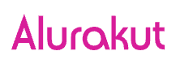

<h1 align="center">
  
</h1>

  <a href="#-tecnologies">Tecnologies</a>&nbsp;&nbsp;&nbsp;|&nbsp;&nbsp;&nbsp;
  <a href="#-project">Project</a>&nbsp;&nbsp;&nbsp;|&nbsp;&nbsp;&nbsp;
  <a href="#-layout">Layout</a>

 

  

 

  

## 🚀 Tecnologies

This project was developed with the following technologies:

- HTML
- CSS
- JavaScript
- React
- Next.js
- Styled Components

## 💻 Project

Alurakut is a project that replicates the old social network Orkut. Added the functionality of registering users, using the github profile, adding friends in the profile and creating communities.

## 🔖 Layout

You can view the project layout through [this link](https://www.figma.com/file/xHF0n0qxiE2rqjqAILiBUB/Alurakut?node-id=58%3A0). It is necessary to have an account in the [Figma](https://figma.com) to access it.
